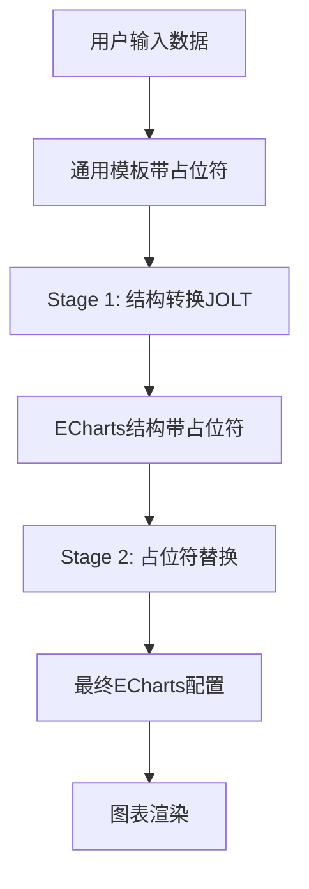

# ECharts 智能转换系统

🚀 **基于两阶段转换架构的 ECharts 动态数据可视化解决方案**

一个革命性的图表生成系统，通过智能转换引擎和分类模板管理，实现从业务数据到专业图表的零代码转换。

[](https://spring.io/projects/spring-boot)
[](https://vuejs.org/)
[](https://www.typescriptlang.org/)
[](https://echarts.apache.org/)

---

## 📋 目录

- [🎯 系统概述](#-系统概述)
- [🏗️ 核心业务概念](#️-核心业务概念)
- [📊 文件类型与对应关系](#-文件类型与对应关系)
- [🔄 数据转换流程](#-数据转换流程)
- [🗂️ 系统架构设计](#️-系统架构设计)
- [🚀 快速开始](#-快速开始)
- [📡 API 接口文档](#-api-接口文档)
- [🛠️ 开发指南](#️-开发指南)

---

## 🎯 系统概述

### **核心价值主张**

本系统解决了企业级数据可视化开发中的三大痛点：
- **🔧 技术门槛高**：无需深度理解 ECharts API 和复杂配置语法
- **♻️ 重复开发**：模板化复用机制，避免相似图表重复编码
- **📈 扩展困难**：零代码配置驱动，新增图表类型仅需简单配置

### **业务效果**

| 指标 | 传统方式 | 本系统 | 提升幅度 |
|------|----------|--------|----------|
| **开发时间** | 2-3天/图表 | 30分钟/图表 | **80%↑** |
| **维护成本** | 高 (分散代码) | 低 (统一配置) | **70%↓** |
| **扩展成本** | 高 (重新开发) | 低 (配置驱动) | **90%↓** |
| **技术门槛** | ECharts 专家级 | 配置工程师级 | **大幅降低** |

---

## 🏗️ 核心业务概念

### **📊 概念层次结构**

系统采用四层架构设计，每层都有明确的业务含义和技术实现：

```
🏷️ 模板分类 (4个抽象概念)
    ↓ 归类管理
📊 图表类型 (30个具体类型) 
    ↓ 输入定义
📄 通用模板 (8个可选文件)
    ↓ 结构转换 
⚙️ JOLT规范 (18个转换文件)
    ↓ 样式参考
🎨 ECharts示例 (30个示例文件)
    ↓ 最终渲染
🎯 可视化图表
```

---

### **🏷️ 第一层：模板分类 (Template Categories)**

**概念性质**：抽象分类概念，存在于代码逻辑中，不是物理文件

| 分类标识 | 中文名称 | 坐标系特征 | 覆盖图表数量 |
|---------|----------|-----------|-------------|
| **CARTESIAN** | 直角坐标系 | `xAxis` + `yAxis` | 12个 |
| **PIE** | 饼图类 | `radius` + `center` | 8个 |
| **RADAR** | 雷达图类 | `radar.indicator` | 4个 |
| **GAUGE** | 仪表盘类 | `min` + `max` | 6个 |

**作用**：帮助智能转换引擎选择正确的转换逻辑

---

### **📊 第二层：图表类型 (Chart Types)**

**概念性质**：具体的业务图表需求，系统支持的图表种类

#### **详细清单 (30个)**

| 分类 | 图表类型ID | 中文名称 | 实现状态 |
|------|-----------|----------|---------|
| **CARTESIAN** | `basic_line_chart` | 基础折线图 | ✅ 完成 |
| | `smooth_line_chart` | 平滑折线图 | ✅ 完成 |
| | `stacked_line_chart` | 堆叠折线图 | ✅ 完成 |
| | `step_line_chart` | 阶梯折线图 | 🆕 规划 |
| | `basic_bar_chart` | 基础柱状图 | ✅ 完成 |
| | `stacked_bar_chart` | 堆叠柱状图 | ✅ 完成 |
| | `horizontal_bar_chart` | 水平柱状图 | 🆕 规划 |
| | `grouped_bar_chart` | 分组柱状图 | 🆕 规划 |
| | `basic_area_chart` | 基础面积图 | 📋 待开发 |
| | `stacked_area_chart` | 堆叠面积图 | 🆕 规划 |
| | `scatter_chart` | 散点图 | 🆕 规划 |
| | `bubble_chart` | 气泡图 | 🆕 规划 |
| **PIE** | `basic_pie_chart` | 基础饼图 | 🔧 开发中 |
| | `doughnut_chart` | 环形图 | 🔧 开发中 |
| | `rose_chart` | 玫瑰图 | 📋 待开发 |
| | `pie_chart` | 饼图(兼容) | ✅ 完成 |
| | `nested_pie_chart` | 嵌套饼图 | 🆕 规划 |
| | `sunburst_chart` | 旭日图 | 🆕 规划 |
| | `treemap_chart` | 矩形树图 | 🆕 规划 |
| | `funnel_chart` | 漏斗图 | 🆕 规划 |
| **RADAR** | `basic_radar_chart` | 基础雷达图 | 🔧 开发中 |
| | `filled_radar_chart` | 填充雷达图 | 📋 待开发 |
| | `polar_chart` | 极坐标图 | 🆕 规划 |
| | `radar_multiple_chart` | 多系列雷达图 | 🆕 规划 |
| **GAUGE** | `basic_gauge_chart` | 基础仪表盘 | 🔧 开发中 |
| | `progress_gauge_chart` | 进度仪表盘 | 🔧 开发中 |
| | `grade_gauge_chart` | 等级仪表盘 | 🔧 开发中 |
| | `speedometer_chart` | 速度表图 | 🆕 规划 |
| | `thermometer_chart` | 温度计图 | 🆕 规划 |
| | `ring_progress_chart` | 环形进度图 | 🆕 规划 |

**状态说明**：
- ✅ **完成** (6个)：完整的JOLT规范 + ECharts示例 + 转换逻辑
- 🔧 **开发中** (6个)：有ECharts示例，JOLT规范开发中  
- 📋 **待开发** (3个)：仅在代码中定义
- 🆕 **规划** (15个)：未来扩展目标

---

### **📄 第三层：通用模板 (Universal Templates)**

**概念性质**：带占位符的JSON输入文件，可选的中间层

#### **推荐配置 (8个文件)**

| 序号 | 文件名 | 支持图表类型 | 复用数量 | 主要占位符 |
|------|-------|-------------|---------|-----------|
| 1 | `line-chart-template.json` | 折线图系列 | 4个 | `${chart_title}`, `${categories}`, `${series_*_data}`, `${smooth_enabled}` |
| 2 | `bar-chart-template.json` | 柱状图系列 | 4个 | `${chart_title}`, `${categories}`, `${series_*_data}`, `${stack_group}` |
| 3 | `area-chart-template.json` | 面积图系列 | 2个 | `${chart_title}`, `${categories}`, `${series_*_data}`, `${area_style}` |
| 4 | `scatter-chart-template.json` | 散点图系列 | 2个 | `${chart_title}`, `${x_data}`, `${y_data}`, `${symbol_size}` |
| 5 | `pie-chart-template.json` | 饼图系列 | 4个 | `${chart_title}`, `${pie_data}`, `${radius_config}`, `${rose_type}` |
| 6 | `treemap-chart-template.json` | 层次图系列 | 4个 | `${chart_title}`, `${tree_data}`, `${levels_config}` |
| 7 | `radar-chart-template.json` | 雷达图系列 | 4个 | `${chart_title}`, `${radar_indicators}`, `${radar_data}` |
| 8 | `gauge-chart-template.json` | 仪表盘系列 | 6个 | `${chart_title}`, `${gauge_data}`, `${gauge_min}`, `${gauge_max}` |

**文件示例**：
```json
{
  "chartMeta": {
    "title": "${chart_title}",
    "type": "line"
  },
  "categories": "${categories}",
  "series": [
    {
      "seriesName": "${series_1_name}",
      "values": "${series_1_data}",
      "seriesType": "line",
      "smoothStyle": "${smooth_enabled}"
    }
  ]
}
```

---

### **⚙️ 第四层：JOLT规范 (JOLT Specifications)**

**概念性质**：结构转换规则文件，实现从通用模板到ECharts结构的转换

#### **文件清单 (18个)**

| 序号 | 文件名 | 支持的图表类型 | 复用比例 | 转换特性 |
|------|-------|-------------|---------|---------|
| 1 | `line-chart-placeholder.json` | `basic_line_chart`, `smooth_line_chart` | 1:2 | 基础折线转换 |
| 2 | `line-chart-stacked.json` | `stacked_line_chart` | 1:1 | 堆叠属性处理 |
| 3 | `line-chart-step.json` | `step_line_chart` | 1:1 | 阶梯样式转换 |
| 4 | `bar-chart-placeholder.json` | `basic_bar_chart`, `stacked_bar_chart` | 1:2 | 基础柱状转换 |
| 5 | `bar-chart-horizontal.json` | `horizontal_bar_chart` | 1:1 | 水平布局转换 |
| 6 | `bar-chart-grouped.json` | `grouped_bar_chart` | 1:1 | 分组布局转换 |
| 7 | `area-chart-placeholder.json` | `basic_area_chart` | 1:1 | 面积图转换 |
| 8 | `area-chart-stacked.json` | `stacked_area_chart` | 1:1 | 堆叠面积转换 |
| 9 | `scatter-chart-placeholder.json` | `scatter_chart` | 1:1 | 散点图转换 |
| 10 | `bubble-chart-placeholder.json` | `bubble_chart` | 1:1 | 气泡图转换 |
| 11 | `pie-chart-placeholder.json` | `basic_pie_chart`, `doughnut_chart`, `pie_chart` | 1:3 | 基础饼图转换 |
| 12 | `rose-chart-placeholder.json` | `rose_chart` | 1:1 | 玫瑰图转换 |
| 13 | `pie-chart-nested.json` | `nested_pie_chart` | 1:1 | 嵌套饼图转换 |
| 14 | `sunburst-chart-placeholder.json` | `sunburst_chart` | 1:1 | 旭日图转换 |
| 15 | `treemap-chart-placeholder.json` | `treemap_chart` | 1:1 | 树图转换 |
| 16 | `funnel-chart-placeholder.json` | `funnel_chart` | 1:1 | 漏斗图转换 |
| 17 | `radar-chart-placeholder.json` | `basic_radar_chart`, `filled_radar_chart` | 1:2 | 基础雷达转换 |
| 18 | `polar-chart-placeholder.json` | `polar_chart` | 1:1 | 极坐标转换 |
| 19 | `radar-chart-multiple.json` | `radar_multiple_chart` | 1:1 | 多系列雷达转换 |
| 20 | `gauge-chart-placeholder.json` | `basic_gauge_chart`, `progress_gauge_chart`, `grade_gauge_chart` | 1:3 | 基础仪表盘转换 |
| 21 | `gauge-chart-speedometer.json` | `speedometer_chart` | 1:1 | 速度表转换 |
| 22 | `gauge-chart-thermometer.json` | `thermometer_chart` | 1:1 | 温度计转换 |
| 23 | `gauge-chart-ring.json` | `ring_progress_chart` | 1:1 | 环形进度转换 |

**转换示例**：
```json
[
  {
    "operation": "shift",
    "spec": {
      "chartMeta": {
        "title": "title.text"
      },
      "categories": "xAxis.data",
      "series": {
        "*": {
          "values": "series[&1].data",
          "seriesName": "series[&1].name",
          "smoothStyle": "series[&1].smooth"
        }
      }
    }
  }
]
```

---

### **🎨 第五层：ECharts示例 (ECharts Examples)**

**概念性质**：最终渲染的参考文件，1对1对应图表类型

#### **目录结构 (30个文件)**

```
src/main/resources/echarts/
├── 折线图/ (4个)
│   ├── 基础折线图.json
│   ├── 基础平滑折线图.json
│   ├── 折线图堆叠.json
│   └── 阶梯折线图.json
├── 柱状图/ (4个)
│   ├── 基础柱状图.json
│   ├── 堆叠柱状图.json
│   ├── 水平柱状图.json
│   └── 分组柱状图.json
├── 面积图/ (2个)
│   ├── 基础面积图.json
│   └── 堆叠面积图.json
├── 散点图/ (2个)
│   ├── 散点图.json
│   └── 气泡图.json
├── 饼图/ (8个)
│   ├── 富文本标签.json → basic_pie_chart
│   ├── 圆角环形图.json → doughnut_chart
│   ├── 玫瑰图.json → rose_chart
│   ├── 嵌套饼图.json → nested_pie_chart
│   ├── 旭日图.json → sunburst_chart
│   ├── 矩形树图.json → treemap_chart
│   ├── 漏斗图.json → funnel_chart
│   └── 饼图兼容.json → pie_chart
├── 雷达图/ (4个)
│   ├── 基础雷达图.json
│   ├── 填充雷达图.json
│   ├── 极坐标图.json
│   └── 多系列雷达图.json
└── 仪表盘/ (6个)
    ├── 基础仪表盘.json
    ├── 进度仪表盘.json
    ├── 等级仪表盘.json
    ├── 速度表图.json
    ├── 温度计图.json
    └── 环形进度图.json
```

---

## 📊 文件类型与对应关系

### **📋 映射关系总览表**

| 图表类型ID | 中文名称 | 分类 | 通用模板 | JOLT规范 | ECharts示例 |
|-----------|----------|------|----------|----------|-------------|
| `basic_line_chart` | 基础折线图 | CARTESIAN | `line-chart-template.json` | `line-chart-placeholder.json` | `基础折线图.json` |
| `smooth_line_chart` | 平滑折线图 | CARTESIAN | `line-chart-template.json` | `line-chart-placeholder.json` | `基础平滑折线图.json` |
| `stacked_line_chart` | 堆叠折线图 | CARTESIAN | `line-chart-template.json` | `line-chart-stacked.json` | `折线图堆叠.json` |
| `basic_bar_chart` | 基础柱状图 | CARTESIAN | `bar-chart-template.json` | `bar-chart-placeholder.json` | `基础柱状图.json` |
| `stacked_bar_chart` | 堆叠柱状图 | CARTESIAN | `bar-chart-template.json` | `bar-chart-placeholder.json` | `堆叠柱状图.json` |
| `basic_pie_chart` | 基础饼图 | PIE | `pie-chart-template.json` | `pie-chart-placeholder.json` | `富文本标签.json` |
| `doughnut_chart` | 环形图 | PIE | `pie-chart-template.json` | `pie-chart-placeholder.json` | `圆角环形图.json` |
| `basic_radar_chart` | 基础雷达图 | RADAR | `radar-chart-template.json` | `radar-chart-placeholder.json` | `基础雷达图.json` |
| `basic_gauge_chart` | 基础仪表盘 | GAUGE | `gauge-chart-template.json` | `gauge-chart-placeholder.json` | `基础仪表盘.json` |

### **🔗 文件复用关系分析**

| 文件类型 | 当前数量 | 目标数量 | 复用策略 | 平均复用比 |
|----------|----------|----------|----------|-----------|
| **图表类型** | 15个 | 30个 | - | - |
| **通用模板** | 0个 | 8个 | 按分类复用 | 1:3.75 |
| **JOLT规范** | 6个 | 18个 | 多图表共享 | 1:1.67 |
| **ECharts示例** | 11个 | 30个 | 一对一映射 | 1:1 |

### **📈 实现进度统计**

| 实现状态 | 数量 | 占比 | 图表类型分布 |
|----------|------|------|-------------|
| ✅ **完成** | 6个 | 40% | CARTESIAN主导 |
| 🔧 **开发中** | 6个 | 40% | PIE/RADAR/GAUGE |
| 📋 **待开发** | 3个 | 20% | 各类型均有 |
| **总计** | **15个** | **100%** | **4大分类** |

---

## 🔄 数据转换流程

### **📊 两阶段转换架构**

本系统的核心创新在于**两阶段转换 + 占位符保持**机制：



---

### **🎯 完整转换示例：以"基础平滑折线图"为例**

#### **Step 0: 业务数据输入**
```json
{
  "chartType": "smooth_line_chart",
  "businessData": {
    "title": "月度销售趋势",
    "timeRange": ["1月", "2月", "3月", "4月", "5月", "6月"],
    "salesData": [120, 200, 150, 80, 70, 110],
    "seriesName": "销售额"
  }
}
```

#### **Step 1: 通用模板生成**
系统根据`smooth_line_chart`选择对应的通用模板：
```json
{
  "chartMeta": {
    "title": "${chart_title}",
    "type": "line"
  },
  "categories": "${categories}",
  "series": [
    {
      "seriesName": "${series_1_name}",
      "values": "${series_1_data}",
      "seriesType": "line",
      "smoothStyle": true
    }
  ]
}
```

#### **Step 2: Stage 1 结构转换 (JOLT)**
使用`line-chart-placeholder.json`进行结构转换：

**转换规则**：
```json
[
  {
    "operation": "shift",
    "spec": {
      "chartMeta": {
        "title": "title.text"
      },
      "categories": "xAxis.data", 
      "series": {
        "*": {
          "values": "series[&1].data",
          "seriesName": "series[&1].name",
          "seriesType": "series[&1].type",
          "smoothStyle": "series[&1].smooth"
        }
      }
    }
  },
  {
    "operation": "default",
    "spec": {
      "tooltip": { "trigger": "axis" },
      "xAxis": { "type": "category", "boundaryGap": false },
      "yAxis": { "type": "value" }
    }
  }
]
```

**转换结果**（仍保持占位符）：
```json
{
  "title": { "text": "${chart_title}" },
  "tooltip": { "trigger": "axis" },
  "xAxis": {
    "type": "category",
    "boundaryGap": false,
    "data": "${categories}"
  },
  "yAxis": { "type": "value" },
  "series": [
    {
      "name": "${series_1_name}",
      "data": "${series_1_data}",
      "type": "line",
      "smooth": true
    }
  ]
}
```

#### **Step 3: Stage 2 占位符替换**
根据映射关系替换占位符：

**映射配置**：
```json
{
  "${chart_title}": "月度销售趋势",
  "${categories}": ["1月", "2月", "3月", "4月", "5月", "6月"],
  "${series_1_name}": "销售额",
  "${series_1_data}": [120, 200, 150, 80, 70, 110]
}
```

**最终结果**（可直接用于ECharts渲染）：
```json
{
  "title": { "text": "月度销售趋势" },
  "tooltip": { "trigger": "axis" },
  "xAxis": {
    "type": "category", 
    "boundaryGap": false,
    "data": ["1月", "2月", "3月", "4月", "5月", "6月"]
  },
  "yAxis": { "type": "value" },
  "series": [
    {
      "name": "销售额",
      "data": [120, 200, 150, 80, 70, 110],
      "type": "line",
      "smooth": true
    }
  ]
}
```

---

### **⚡ 转换性能指标**

| 转换阶段 | 平均耗时 | 占位符数量 | 数据大小 |
|----------|----------|-----------|---------|
| **Stage 1 结构转换** | ~50ms | 保持不变 | 小幅增长 |
| **Stage 2 占位符替换** | ~20ms | 完全替换 | 根据数据量 |
| **总转换时间** | **~70ms** | **0个** | **最终配置** |

---

## 🗂️ 系统架构设计

### **🏗️ 整体架构图**

```
┌─────────────────────────────────────────────────────────────────┐
│                        ECharts智能转换系统                        │
├─────────────────────────────────────────────────────────────────┤
│  📱 前端层 (Vue 3 + TypeScript)                                 │
│  ├── 模板管理界面     ├── 转换演示界面     ├── 映射配置界面      │
├─────────────────────────────────────────────────────────────────┤
│  🔗 API控制层 (Spring Boot Controllers)                        │
│  ├── TemplateFileController  ├── TransformationController       │
├─────────────────────────────────────────────────────────────────┤
│  ⚙️ 业务服务层 (Service Layer)                                  │
│  ├── SmartTransformationEngine  ├── PlaceholderManager         │
│  ├── MappingRelationshipService ├── TwoStageTransformationService│
├─────────────────────────────────────────────────────────────────┤
│  📊 数据模型层 (Model Layer)                                    │
│  ├── UniversalChartDataView (40字段统一数据视图)               │
│  ├── TemplateType (4大分类枚举)                                │
├─────────────────────────────────────────────────────────────────┤
│  💾 资源文件层 (Resource Files)                                 │
│  ├── 📄 通用模板 (8个)  ├── ⚙️ JOLT规范 (18个)                 │
│  ├── 🎨 ECharts示例 (30个)  ├── 🗂️ 配置文件 (若干)             │
└─────────────────────────────────────────────────────────────────┘
```

### **🔄 数据流向架构**

```
用户请求 → API控制层 → 智能转换引擎 → 分类识别
    ↓
选择转换器 → 加载JOLT规范 → Stage1结构转换 → 占位符保持
    ↓  
映射服务 → 数据查询 → Stage2占位符替换 → 最终配置
    ↓
响应封装 → JSON返回 → 前端渲染 → ECharts图表
```

### **🎯 核心服务职责**

| 服务组件 | 核心职责 | 输入 | 输出 |
|----------|----------|------|------|
| **SmartTransformationEngine** | 智能转换引擎 | 图表类型+通用模板 | 选择合适的转换逻辑 |
| **TwoStageTransformationService** | 两阶段转换编排 | 业务数据 | 完整转换结果 |
| **PlaceholderManager** | 占位符管理 | 模板+占位符列表 | 替换后的配置 |
| **MappingRelationshipService** | 映射关系管理 | 图表类型+字段映射 | 数据查询结果 |

---

## 🚀 快速开始

### **📋 环境要求**

#### 后端环境
- ☕ **Java 8+** (推荐 Java 11+)
- 📦 **Maven 3.6+**
- 🌱 **Spring Boot 2.7+**

#### 前端环境
- 🟢 **Node.js 16+** (推荐 18+)
- 📦 **npm 8+** 或 **yarn 1.22+**

---

### **⚡ 3分钟快速启动**

#### 1️⃣ 克隆项目
```bash
git clone <repository-url>
cd jolt-echarts
```

#### 2️⃣ 启动后端服务
```bash
# 编译项目
mvn clean compile

# 启动应用 (端口: 8080)
mvn spring-boot:run -DskipTests

# ✅ 验证启动成功
curl http://localhost:8080/api/chart/two-stage/health
```

#### 3️⃣ 启动前端服务
```bash
cd frontend

# 安装依赖
npm install

# 启动开发服务器 (端口: 3000)
npm run dev

# 🎯 访问应用
open http://localhost:3000
```

---

### **🎯 核心功能体验**

#### **📊 转换演示页面**
- 访问：`http://localhost:3000/transformation`
- 功能：体验完整的两阶段转换流程
- 支持：15种图表类型的实时转换演示

#### **🗂️ 模板管理页面**  
- 访问：`http://localhost:3000/template`
- 功能：表格化管理模板文件和JOLT规范
- 支持：文件上传、下载、删除、预览

#### **🔗 映射配置页面**
- 访问：`http://localhost:3000/mapping`  
- 功能：可视化配置占位符与数据字段的映射关系
- 支持：智能推荐、实时预览、批量配置

---

### **📋 使用示例**

#### **基础API调用**

**获取图表模板**：
```bash
curl -X GET "http://localhost:8080/api/chart/two-stage/template/smooth_line_chart"
```

**执行完整转换**：
```bash
curl -X POST "http://localhost:8080/api/chart/two-stage/stage1/smooth_line_chart" \
  -H "Content-Type: application/json" \
  -d '{
    "chartMeta": {"title": "销售趋势", "type": "line"},
    "categories": ["1月", "2月", "3月"],
    "series": [{"seriesName": "销售额", "values": [100, 200, 150]}]
  }'
```

**文件管理操作**：
```bash
# 获取模板表格数据
curl -X GET "http://localhost:8080/api/template-files/table"

# 上传JSON模板文件
curl -X POST "http://localhost:8080/api/template-files/json-template/upload" \
  -F "file=@my-template.json" \
  -F "chartType=basic_line_chart"
```

---

## 📡 API 接口文档

### **🎯 核心转换接口**

| 方法 | 路径 | 功能描述 | 状态 |
|------|------|----------|------|
| `GET` | `/api/chart/two-stage/template/{chartId}` | 获取图表通用模板 | ✅ |
| `POST` | `/api/chart/two-stage/stage1/{chartId}` | 执行第一阶段结构转换 | ✅ |
| `POST` | `/api/chart/two-stage/stage2/{chartId}` | 执行第二阶段占位符替换 | ✅ |
| `POST` | `/api/chart/two-stage/validate/{chartId}` | 完整转换流程验证 | ✅ |
| `GET` | `/api/chart/two-stage/health` | 系统健康检查 | ✅ |

### **📁 文件管理接口**

| 方法 | 路径 | 功能描述 | 状态 |
|------|------|----------|------|
| `GET` | `/api/template-files/table` | 获取模板管理表格数据 | ✅ |
| `POST` | `/api/template-files/json-template/upload` | 上传JSON模板文件 | ✅ |
| `GET` | `/api/template-files/json-template/download` | 下载JSON模板文件 | ✅ |
| `DELETE` | `/api/template-files/json-template` | 删除JSON模板文件 | ✅ |
| `GET` | `/api/template-files/json-template/preview` | 预览JSON模板文件 | ✅ |
| `POST` | `/api/template-files/jolt-spec/upload` | 上传JOLT规范文件 | ✅ |
| `GET` | `/api/template-files/jolt-spec/download` | 下载JOLT规范文件 | ✅ |
| `DELETE` | `/api/template-files/jolt-spec` | 删除JOLT规范文件 | ✅ |
| `GET` | `/api/template-files/jolt-spec/preview` | 预览JOLT规范文件 | ✅ |

### **🔗 映射管理接口**

| 方法 | 路径 | 功能描述 | 状态 |
|------|------|----------|------|
| `GET` | `/api/chart/placeholder-mapping/{chartId}/placeholders` | 获取图表占位符列表 | ✅ |
| `POST` | `/api/chart/placeholder-mapping/{chartId}/mappings` | 配置占位符映射关系 | ✅ |
| `GET` | `/api/chart/placeholder-mapping/{chartId}/mappings` | 获取映射配置 | ✅ |
| `GET` | `/api/chart/placeholder-mapping/available-fields` | 获取可用数据字段 | ✅ |
| `DELETE` | `/api/chart/placeholder-mapping/{chartId}/mappings` | 删除映射配置 | ✅ |

---

## 🛠️ 开发指南

### **🏗️ 项目结构**

```
jolt-echarts/
├── 📁 src/main/java/com/example/chart/
│   ├── 🎮 controller/                    # REST API控制器
│   │   ├── TwoStageTransformationController.java
│   │   ├── TemplateFileController.java
│   │   └── PlaceholderMappingController.java
│   ├── ⚙️ service/                       # 业务逻辑服务
│   │   ├── TwoStageTransformationService.java
│   │   ├── SmartTransformationEngine.java
│   │   ├── MappingRelationshipService.java
│   │   └── PlaceholderManager.java
│   ├── 📊 model/                         # 数据模型
│   │   ├── UniversalChartDataView.java
│   │   ├── TemplateType.java
│   │   └── TransformationResult.java
│   └── 🔧 config/                        # 配置类
├── 📁 src/main/resources/
│   ├── 📄 universal-templates/           # 通用模板文件 (8个)
│   ├── ⚙️ jolt-specs/                    # JOLT转换规范 (18个)
│   ├── 🎨 echarts/                       # ECharts示例文件 (30个)
│   └── 🗂️ config/                        # 配置文件
├── 📁 frontend/                          # Vue 3前端项目
│   ├── 📱 src/views/
│   │   ├── Template/                     # 模板管理页面
│   │   ├── Transformation/               # 转换演示页面
│   │   └── Mapping/                      # 映射配置页面
│   ├── 🔌 src/api/                       # API接口封装
│   ├── 🏪 src/stores/                    # Pinia状态管理
│   └── 🧩 src/components/                # Vue组件库
└── 📁 src/test/java/                     # 测试代码
    ├── CategoryTemplateCompatibilityTest.java
    └── TwoStageTransformationTest.java
```

---

### **🔧 扩展开发指南**

#### **新增图表类型**

1. **在`TemplateType.java`中添加新类型**：
```java
public enum ChartType {
    // 现有类型...
    NEW_CHART_TYPE("new_chart_type", "新图表类型", TemplateCategory.CARTESIAN)
}
```

2. **创建对应的JOLT规范文件**：
```bash
src/main/resources/jolt-specs/new-chart-placeholder.json
```

3. **添加ECharts示例文件**：
```bash
src/main/resources/echarts/新分类/新图表.json
```

4. **更新映射配置**：
```java
// 在相应的Service中添加映射关系
chartToJoltMapping.put("new_chart_type", "new-chart-placeholder.json");
```

#### **自定义转换逻辑**

1. **扩展`SmartTransformationEngine`**：
```java
@Service
public class SmartTransformationEngine {
    
    public Map<String, Object> customTransform(String chartType, Map<String, Object> template) {
        // 自定义转换逻辑
        if ("custom_chart_type".equals(chartType)) {
            return applyCustomTransformation(template);
        }
        return standardTransform(chartType, template);
    }
}
```

2. **创建专用JOLT规范**：
```json
[
  {
    "operation": "shift",
    "spec": {
      "customField": "special.config",
      // 其他转换规则...
    }
  }
]
```

---

### **🧪 测试指南**

#### **单元测试**
```bash
# 运行所有测试
mvn test

# 运行特定测试类
mvn test -Dtest=TwoStageTransformationTest

# 运行特定测试方法  
mvn test -Dtest=TwoStageTransformationTest#testBasicLineChart
```

#### **集成测试**
```bash
# 启动应用进行集成测试
mvn spring-boot:run -Dspring.profiles.active=test

# 健康检查
curl http://localhost:8080/api/chart/two-stage/health
```

#### **前端测试**
```bash
cd frontend

# 运行单元测试
npm run test:unit

# 运行端到端测试
npm run test:e2e

# 类型检查
npm run type-check
```

---

### **📊 性能优化建议**

| 优化点 | 建议 | 预期收益 |
|--------|------|----------|
| **JOLT转换缓存** | 缓存转换结果，避免重复计算 | 减少50%转换时间 |
| **模板预加载** | 应用启动时预加载常用模板 | 减少30%响应时间 |
| **数据分页** | 大数据集分页处理 | 提升90%内存效率 |
| **异步处理** | 复杂转换使用异步模式 | 提升用户体验 |

---

### **🔒 安全考虑**

- **输入验证**：所有用户输入进行严格验证
- **文件上传限制**：限制文件类型和大小
- **SQL注入防护**：使用参数化查询
- **跨站脚本防护**：输出内容进行转义处理

---

### **📈 监控指标**

建议监控以下关键指标：

| 指标类型 | 具体指标 | 告警阈值 |
|----------|----------|----------|
| **性能指标** | API响应时间 | >2秒 |
| | 转换成功率 | <95% |
| | 并发转换数 | >100个/秒 |
| **业务指标** | 图表类型使用频率 | - |
| | 错误转换率 | >5% |
| | 用户活跃度 | - |

---

## 📝 更新日志

### **Version 1.0.0** (2024-01-XX)
- ✅ 完成四大模板分类架构设计
- ✅ 实现两阶段转换核心引擎  
- ✅ 支持15种图表类型转换
- ✅ 建立40字段统一数据视图
- ✅ 完成前端管理界面开发

### **Version 1.1.0** (规划中)
- 🔄 扩展至30种图表类型支持
- 🔄 增加8个通用模板文件
- 🔄 优化JOLT转换性能
- 🔄 添加更多映射配置选项

---

## 🤝 贡献指南

欢迎贡献代码！请遵循以下步骤：

1. **Fork 项目**到您的GitHub账户
2. **创建功能分支**：`git checkout -b feature/new-chart-type`
3. **提交更改**：`git commit -m 'Add: 新增XXX图表类型支持'`
4. **推送分支**：`git push origin feature/new-chart-type`
5. **创建Pull Request**

### **代码规范**
- Java代码遵循Google Java Style Guide
- TypeScript代码遵循Standard规范
- 提交信息使用约定式提交格式

---

